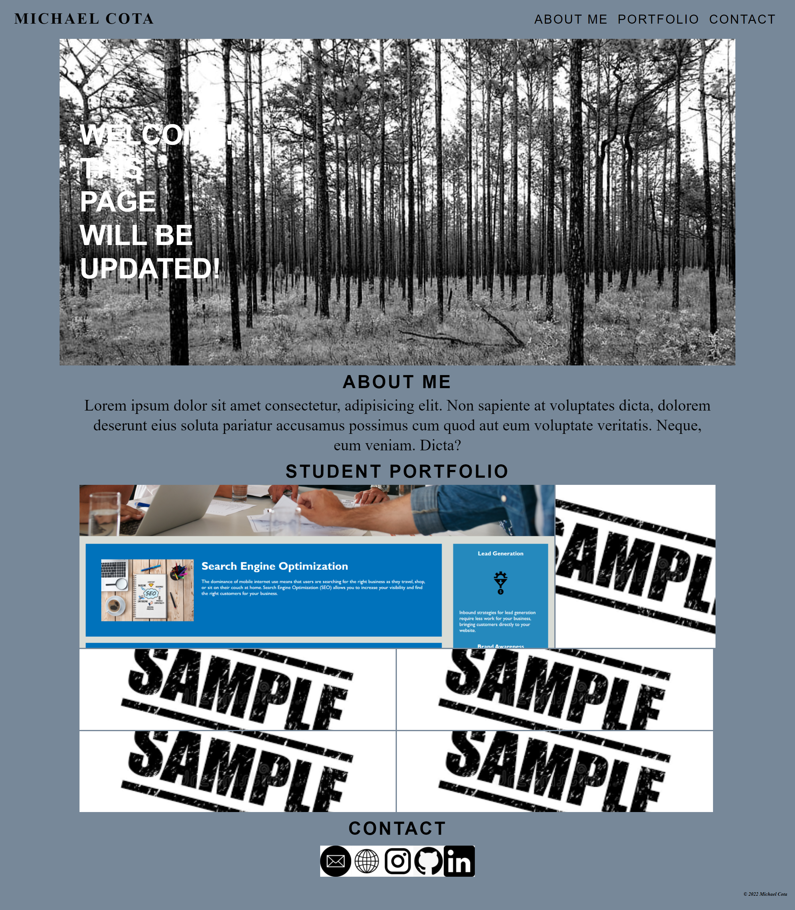

# Advanced CSS Challenge: My Developer Portfolio

## Description

For this challenge, I was tasked with creating a portfolio for my web development work, using only HTML and advanced CSS (including flexbox, CSS Grid, media queries, and CSS variables).

## Acceptance Criteria

* Portfolio must include:
    * Developer's name
    * A recent photo
    * An "About Me" section
    * A portfolio/showcase of work
    * Contact info
* Links in navigation must scroll to corresponding section
* Primary portfolio image must be larger than others
* Portfolio images link to deployed applications/projects
* Site is responsive on various screens and devices

*Placeholders are acceptable, as this site will be updated as the course progresses*

## Website Link

https://mikecota09.github.io/Michael-Cota-Portfolio/

## Link to repository

https://github.com/mikecota09/Michael-Cota-Portfolio

## Screenshot

## Contact
[Michael Cota on GitHub](http://github.com/mikecota09)